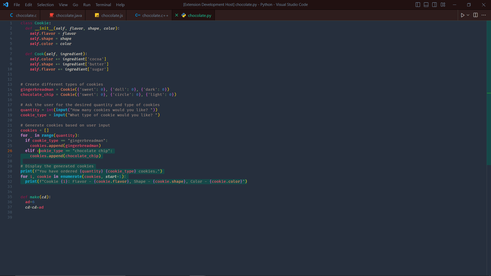
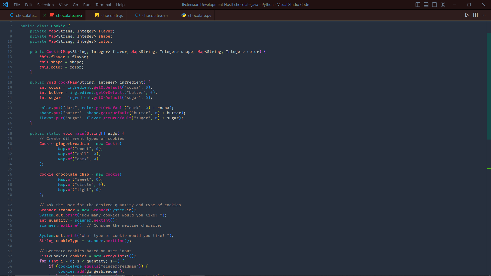
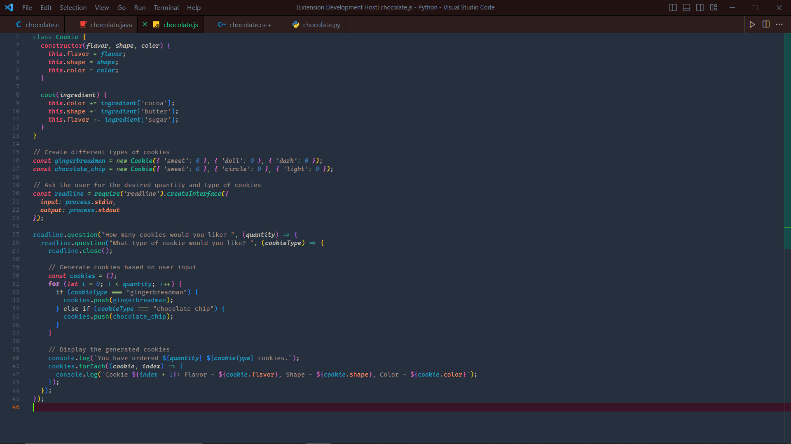
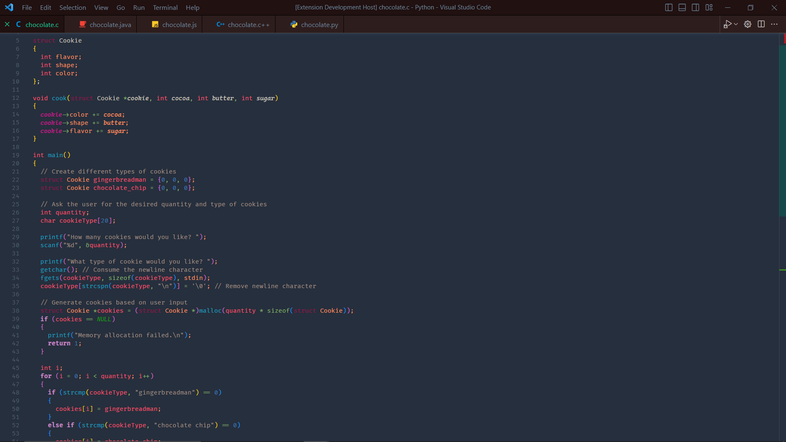
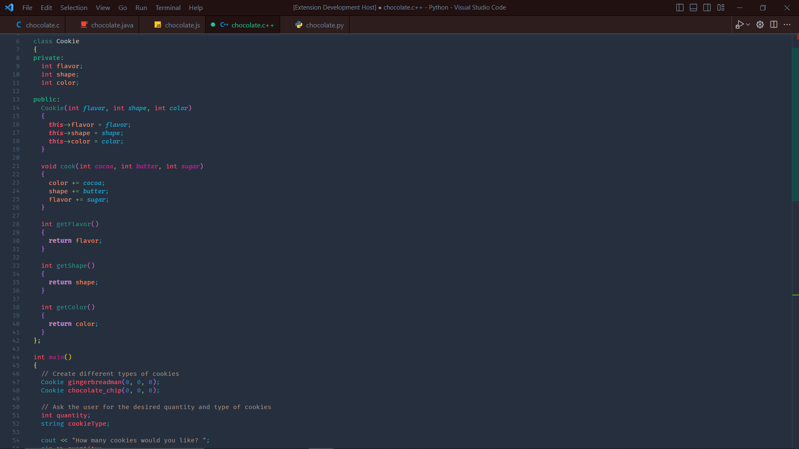
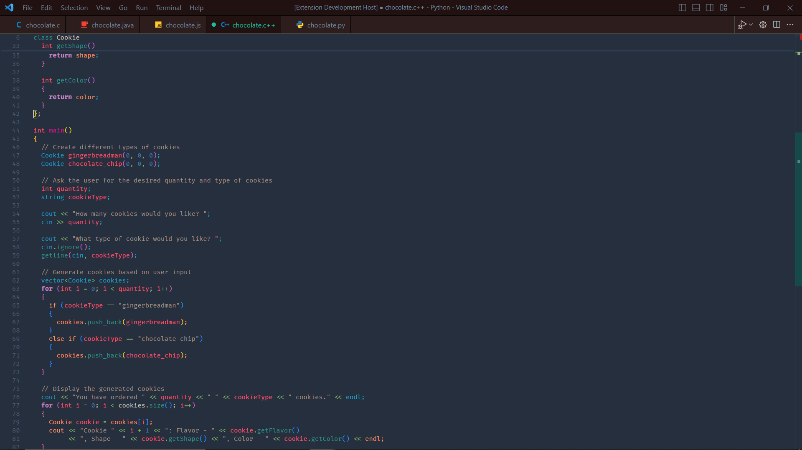

Python




Java




JavaScript




C




C++




C++




I recommend downloading [indent-rainbow](vscode:extension/oderwat.indent-rainbow) and putting this code in your json file


```json
 "indentRainbow.errorColor": "rgba(255,255,255,1)",
  "indentRainbow.colors": [
    "rgba(230,0,255,0.08)",
    "rgba(255,0,80,0.08)",
    "rgba(79,236,236,0.08)",
    "rgba(255,94,0,0.08)"
  ]

```
